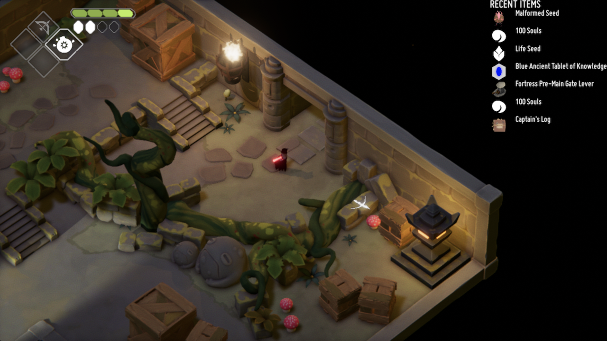

This is a Death's Door mod for displaying items recently acquired
from [plandos][], or other mods that use [ItemChanger][] to place
their items.

# Screenshot

# How to use

Install this mod, along with [MagicUI][], and open any file (even an existing one) that uses ItemChanger
(a plando file, for example), and you will see a list of recent items in the top
right corner.

To change how many items appear, open the `deathsdoor.recentitemsdisplay.cfg` file in your `BepInEx/config` directory (if you don't have it, launch the game once with the mod installed to generate it), and change
the number after `MaxNumEntries =` to what you want. Setting it to zero
disables the mod altogether.

By default, the name of the area the item was obtained from is shown; if
you would prefer to not have it, you may disable `ShowAreaName` in the settings.

Alternatively, you may use [BepInEx's configuration manager][biecfg], which provides an in-game GUI to configure your mod settings.

[biecfg]: https://github.com/BepInEx/BepInEx.ConfigurationManager

# How to build

To build this mod, you will need to place the BepInEx DLLs (or
symlinks/hardlinks to them) in the `ItemChanger/Deps` directory;
you will also need the [MagicUI][] and [ItemChanger][] DLLs there.

[plandos]: https://github.com/dpinela/DeathsDoor.Plando
[ItemChanger]: https://github.com/dpinela/DeathsDoor.ItemChanger
[MagicUI]: https://github.com/dpinela/DeathsDoor.MagicUI